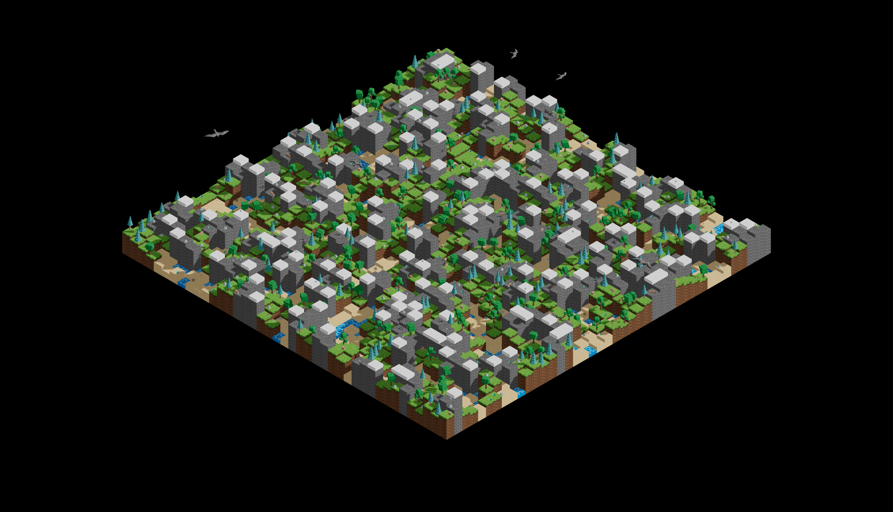

# AoC 2024 Visualization

Visualization of input data from "Day 10: Hoof It" of the [Advent of Code](https://adventofcode.com/) 2024 challenge.




### Installation

Clone the repo and run the app.

1. Clone the repo
   ```sh
   git clone https://github.com/MartinHabdak/AoC-2024-Visualization.git
   ```
2. Install NPM packages
   ```sh
   npm install
   ```
3. Run the app
   ```sh
   npm run dev
   ```
   
### Usage

The `input.txt` file contains the sample input data of the day 10 challenge. Replace its content with your day 10 puzzle input to visualize your puzzle data.

### License

Distributed under the MIT License. See `LICENSE.txt` for more information.
   
